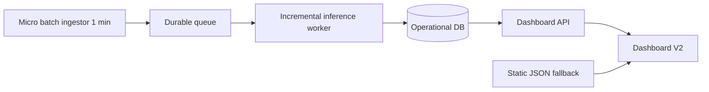

# Real-Time Pipeline Rollout Plan

## Approved Target

- Real-time style operation via 1-minute micro-batches
- Durable queue between ingest and processing
- Operational database for tweet-level and aggregate data
- API-first dashboard reads
- Static fallback retained via `dashboard/public/data.json`

## Target Architecture

## Implementation Checklist for Code Mode

- [ ] Add micro-batch ingestion service derived from `scraper.py` with checkpoint tracking
- [ ] Introduce queue producer and consumer contracts with idempotent message keys
- [ ] Refactor enrichment logic from `generate_dashboard_data.py` into incremental worker functions
- [ ] Persist raw events and normalized features into operational tables or collections
- [ ] Build aggregation jobs for KPIs used by `dashboard/app/v2/page.js` and V2 widgets
- [ ] Expose API endpoints that match current `data.json` shape for compatibility
- [ ] Add dashboard data client that tries API first then falls back to `dashboard/public/data.json`
- [ ] Implement near-real-time refresh loop then optional SSE invalidation channel
- [ ] Add feature flag for JSON-only mode and API-live mode
- [ ] Add parity checker comparing API payloads vs current batch output fields
- [ ] Add observability metrics queue lag ingest lag inference errors API latency data freshness
- [ ] Add rollback runbook and one-command fallback to JSON-only serving

## Phase Gates

1. Shadow ingest only no user-facing changes
2. Incremental parity against batch outputs
3. API read path with automatic fallback
4. Live refresh and push invalidation
5. Controlled cutover and canary

## Non-Negotiable Safety Controls

- Duplicate prevention by source post id and canonical text hash
- Dead-letter queue for malformed records
- Schema versioning for API payload compatibility
- Latency and freshness alarms with rollback trigger
